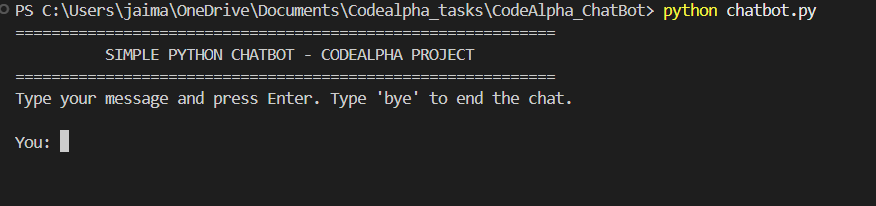
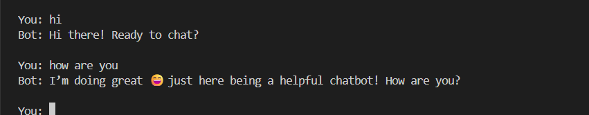
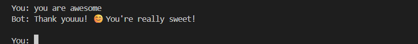
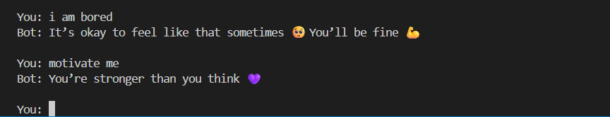
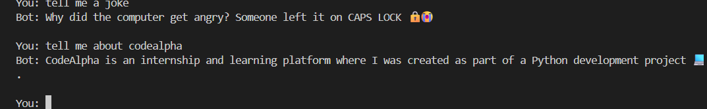
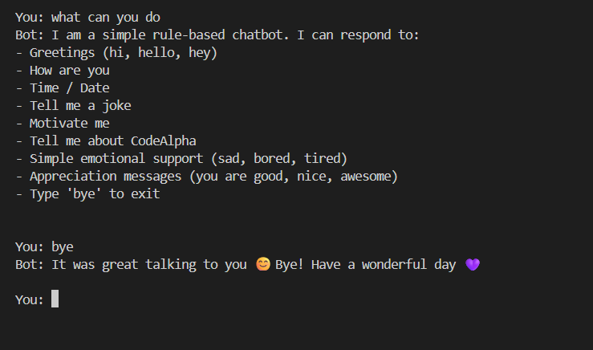

# 🗨️ Simple Python Chatbot — CodeAlpha Internship Project

This is a **rule-based console chatbot** built using **Python** as part of the **CodeAlpha Internship** tasks.  
The chatbot interacts like a friendly virtual assistant, responding to greetings, emotions, jokes, motivation, date/time queries, and basic support responses.

---

## ✨ Features

- 👋 Understands greetings (hi, hello, hey)
- 😊 Responds to compliments (you are good, nice, awesome)
- 🥺 Emotional support messages (sad, bored, tired)
- 💪 Motivational quotes on request
- 😂 Random programming jokes
- 🕒 Tells current time and date
- 💻 Shares info about CodeAlpha internship
- 🔧 Shows a list of commands (help)
- 🚪 Graceful exit on `bye` / `exit`

---

## 🛠 Tech Stack

| Component | Used                             |
| --------- | -------------------------------- |
| Language  | Python 3                         |
| Approach  | Rule-based keyword matching      |
| Platform  | Works in terminal / command line |

No external libraries required.

---

## 🚀 How to Run the Chatbot

Run these commands in your terminal:

```bash
cd Codealpha_Tasks/ChatBot
python chatbot.py
```

Then start chatting:

```bash
You: hi
You: how are you
You: you are good
You: joke
You: motivate me
You: help
You: bye
```

---

## 📸 Screenshots

### 🔹 Intro Screen



### 🔹 Greeting Interaction



### 🔹 Compliment Reply



### 🔹 Motivation & Emotion Handling



### 🔹 Jokes + CodeAlpha Info



### 🔹 Help + Exit



---

## 🔮 Future Improvements

. Add machine learning NLP model

. Add GUI using PyQt or Tkinter

. Add voice input/output

. Add API-based smart responses

---

## 🏆 Internship Task Info

This project is part of the CodeAlpha Python Development Internship
Task: Build a Simple Python ChatBot Project

---

## 👩🏻‍💻 Author

Pesala Ananya
Python & UI Enthusiast
