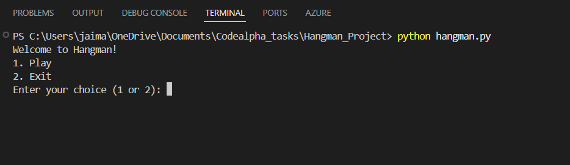
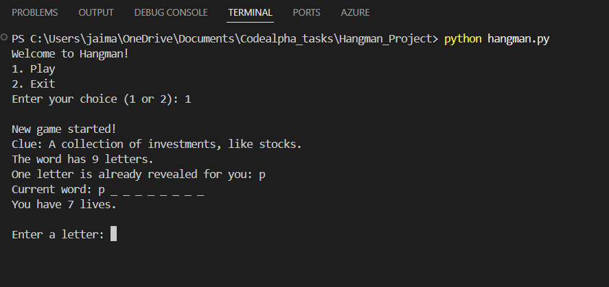
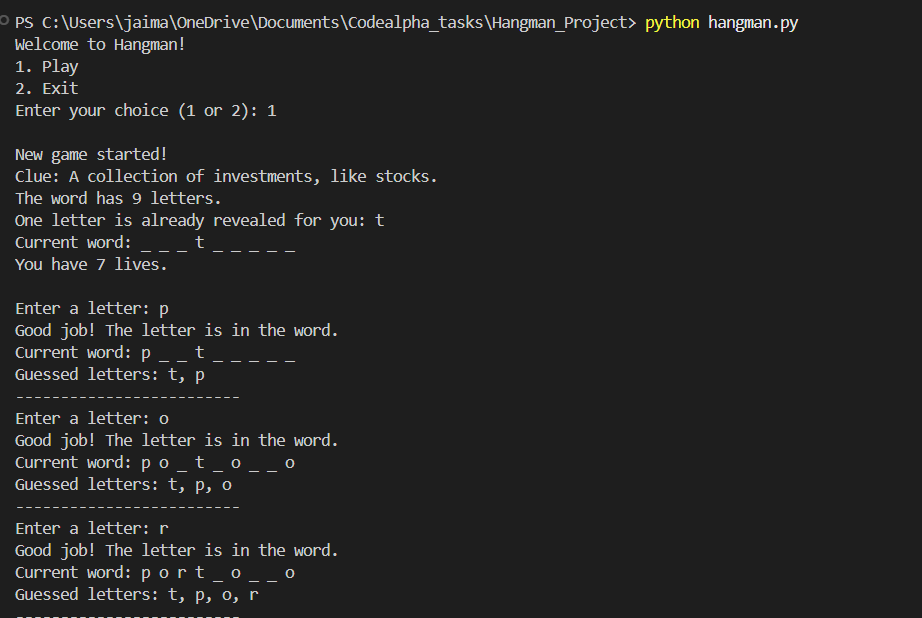
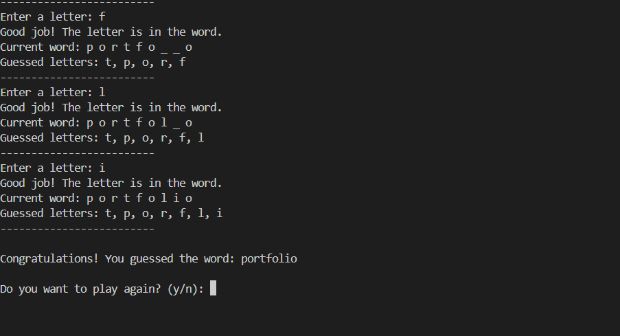
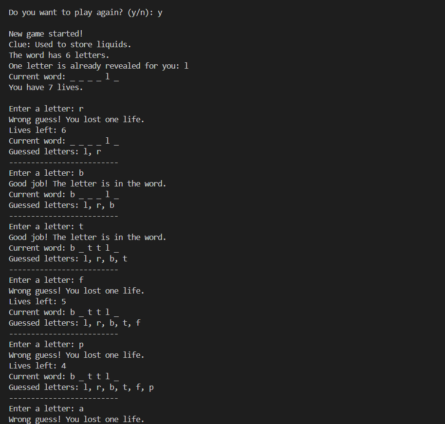
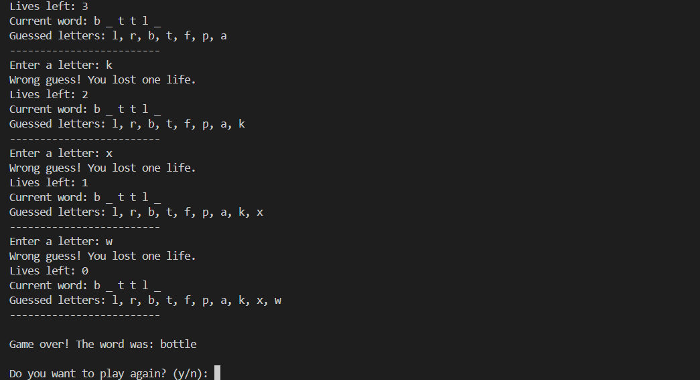

# Hangman Game 🎮

This is a simple text-based Hangman game built in Python as part of my **CodeAlpha Python Internship**.

The computer picks a secret word and gives the player:

- A **clue** related to the word
- One **letter revealed** at the start
- **7 lives** to guess the remaining letters

The player guesses letters one by one until:

- They **guess the full word** ✅, or
- They **run out of lives** ❌

---

## 🔧 Features

- Random word selection from a predefined word list
- Each word has a **specific clue**
- One **random letter is revealed** at the beginning
- Tracks:
  - Correct guesses
  - Wrong guesses
  - Remaining lives
- Prevents duplicate guesses
- Option to **play again** without restarting the program

---

## 🧠 Technologies Used

- **Language:** Python 3
- **Standard library:** `random` (for word and index selection)

No external libraries are required.

---

## ▶️ How to Run

1. Make sure you have **Python 3** installed.
2. Open a terminal or command prompt.
3. Navigate to the folder where `hangman.py` is located:
   ```bash
   cd CodeAlpha-Python-Internship/Hangman
   ```
4. Run the script:
   ```bash
    python hangman.py
   ```

---

## 🖼️ Screenshots

### 🔹 Main Menu



### 🔹 Game Start (Clue + Revealed Letter)



### 🔹 Win Screens





### 🔹 Lose Screens





---

## 📌 Project Info

Internship: CodeAlpha – Python Programming

Task: Hangman Game

Developer: Pesala Ananya

---
